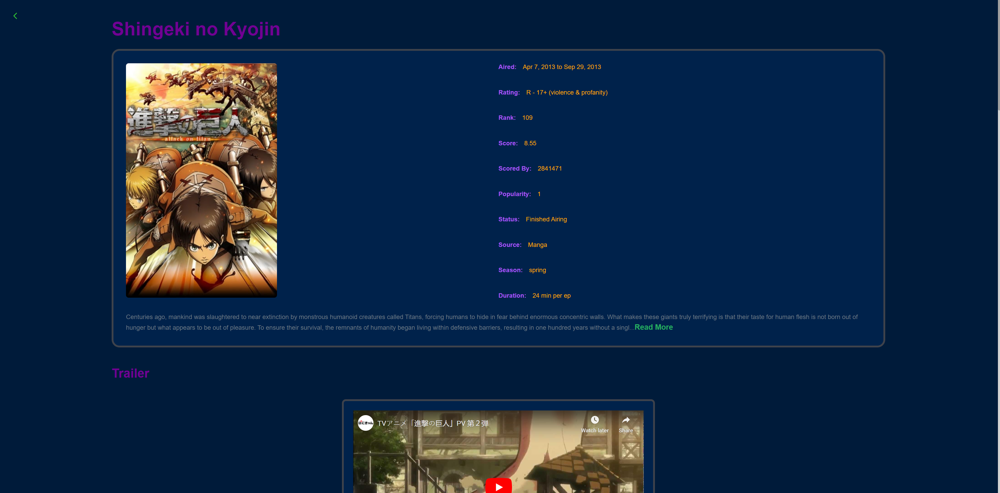
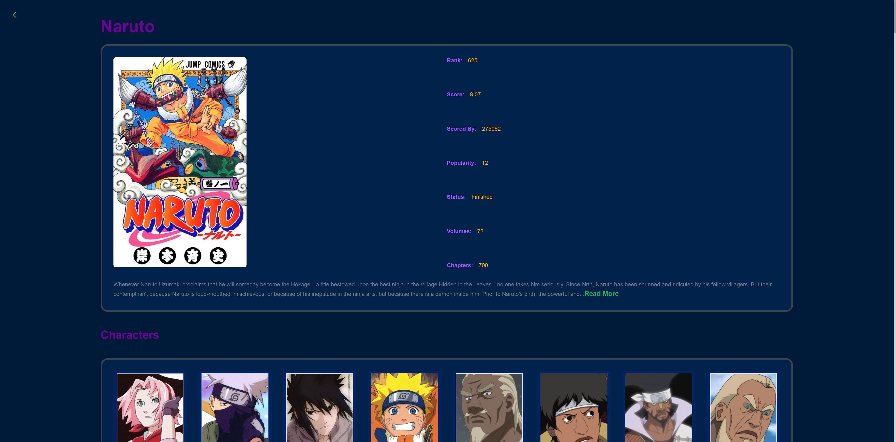

# anime & manga website
Built using React and Jikan API

# Install dependencies
npm install

# Start the development server
npm start

# Features
Website that Fetches and displays popular Anime/Manga

Ultizes Jikan API to get and filter Popular/Upcoming/Airing Anime as well as getting the details of specific Anime/Manga
Anime

Manga

Also Allows for the search for Anime/Manga by their title

Anime Search

Manga Search

